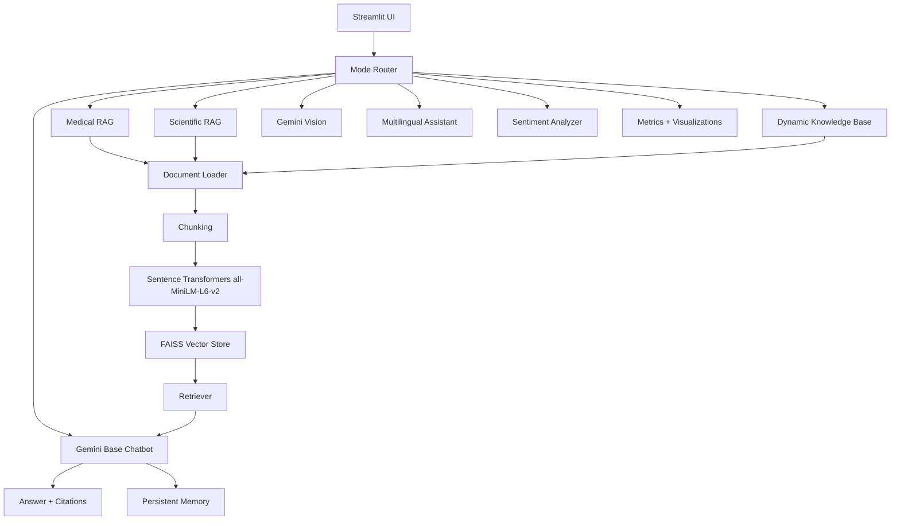

# AI-Assistant-Internship

Production-quality internship project that integrates a general Gemini chatbot, medical RAG over MedQuAD, scientific RAG over arXiv metadata, dynamic knowledge base expansion, multimodal image understanding, multilingual support, sentiment analysis, persistent memory, and analytics in one Streamlit application.

## Project Overview

This repository implements one unified AI Assistant rather than separate demos. The app supports multiple assistant modes from a professional dashboard:

- General Gemini chatbot with streaming-ready backend, conversation history, system prompt, temperature control, and clear chat.
- Medical chatbot powered by MedQuAD-style records, FAISS retrieval, citations, top-k control, and a medical disclaimer.
- Scientific/domain expert chatbot powered by arXiv metadata for paper retrieval, summarization, context generation, and references.
- Dynamic knowledge base where uploaded PDF, TXT, MD, and DOCX files are extracted, chunked, embedded, indexed in FAISS, persisted, reloaded, and periodically updated through an incremental scheduled pipeline.
- Gemini Vision with evidence-based multimodal reasoning, OCR-assisted analysis, ambiguity detection, validation, and mixed image plus text context.
- Multilingual flow with language detection, translation to English, generation/retrieval, translation back to English, Hindi, Bengali, or Spanish, and preserved context after language switches.
- Sentiment analysis with full response adaptation, tone-alignment evaluation, and sentiment distribution visualization.
- Persistent and windowed memory with Markdown chat export.
- Analytics for dataset statistics, latency, sentiment, confusion matrix utilities, and embedding visualization.
- Internship task audit with explicit evidence for each required task card.

## Architecture



## Folder Structure

```text
AI-Assistant-Internship/
|-- app.py
|-- schedule_knowledge_updates.py
|-- config.py
|-- requirements.txt
|-- chatbot/
|   |-- base_chatbot.py
|   |-- embeddings.py
|   |-- knowledge_base.py
|   |-- medical.py
|   |-- memory.py
|   |-- multilingual.py
|   |-- rag.py
|   |-- retriever.py
|   |-- sentiment.py
|   `-- vision.py
|-- utils/
|   |-- document_loader.py
|   |-- logging.py
|   |-- metrics.py
|   |-- text_processing.py
|   `-- visualization.py
|-- data/
|   |-- medical/
|   `-- arxiv/
|-- uploads/
|-- vector_db/
|-- reports/
|-- tests/
`-- .github/
```

## Installation

Use Python 3.10 or 3.11 for the most reliable install. Python 3.13 may fail because several AI/ML wheels, especially FAISS, Torch, spaCy, and NumPy pins, may not be available for it yet.

```bash
git clone <your-repository-url>
cd AI-Assistant-Internship
py -3.11 -m venv .venv
.\.venv\Scripts\python.exe -m pip install --upgrade pip
.\.venv\Scripts\python.exe -m pip install -r requirements.txt
.\.venv\Scripts\python.exe -m spacy download en_core_web_sm
.\.venv\Scripts\python.exe -m nltk.downloader punkt vader_lexicon
copy .env.example .env
```

If PowerShell blocks `.venv\Scripts\Activate.ps1`, you can skip activation and keep using `.\.venv\Scripts\python.exe` as shown above.

Edit `.env` and set:

```env
GEMINI_API_KEY=your_google_gemini_api_key_here
```

## Usage

```bash
.\.venv\Scripts\python.exe -m streamlit run app.py
```

## Evaluator Remediation Evidence

The repository includes an explicit remediation report at [`reports/evaluator_remediation.md`](reports/evaluator_remediation.md). It documents:

- automated periodic knowledge expansion with incremental SHA-256 indexing;
- multimodal evidence extraction, ambiguity handling, response validation, and decision output;
- Computer Science arXiv subset retrieval with concept graphs, follow-up questions, and open-source summarization fallback;
- complete sentiment-aware response generation and evaluation;
- context-preserving multilingual conversation across language switches.

Open the local Streamlit URL. Use the sidebar to select the chatbot mode, upload documents, upload images, set top-k retrieval, adjust temperature, clear history, and download chat history.

To run a one-shot dynamic knowledge-base expansion from configured sources:

```bash
copy knowledge_sources.example.json knowledge_sources.json
.\.venv\Scripts\python.exe update_knowledge_base.py
```

For periodic updates on Windows Task Scheduler, schedule that command daily or hourly depending on your dataset update frequency.

## Dataset Setup

Small sample records are included so the app and tests have a working schema. For the full internship evaluation:

- Place MedQuAD JSON, JSONL, CSV, or TXT files in `data/medical/`.
- Place arXiv metadata JSON, JSONL, CSV, or TXT files in `data/arxiv/`.

Supported MedQuAD fields include `question`, `answer`, `focus_area`, and `source`. Supported arXiv fields include `id`, `title`, `authors`, `categories`, `abstract`, and `summary`.

## Methodology

1. Load structured datasets or uploaded files.
2. Extract and clean text.
3. Chunk text with overlap.
4. Generate `all-MiniLM-L6-v2` embeddings.
5. Store vectors in FAISS.
6. Retrieve top-k relevant chunks.
7. Compose grounded prompts.
8. Generate answers with Gemini.
9. Return citations, references, disclaimers, and analytics.

## Preprocessing, Feature Engineering, And Model Selection

- Preprocessing: whitespace normalization, control-character removal, PDF/TXT/DOCX extraction, MedQuAD question-answer formatting, arXiv metadata formatting, sentence-aware chunking, and overlap windows.
- Feature engineering: medical entity recognition, arXiv concept extraction, OCR text extraction, sentiment labels, language segments, citation metadata, and response latency metrics.
- Model selection: baseline direct Gemini prompt compared with the advanced RAG assistant using Gemini, FAISS, and `all-MiniLM-L6-v2` embeddings. See `reports/model_comparison.md`.
- Reproducibility: `.env.example`, `requirements.txt`, sample datasets, tests, CI workflow, and notebook artifact are included.

## Screenshots

Add screenshots after running the app:

- `images/dashboard.png`
- `images/medical_rag.png`
- `images/scientific_rag.png`
- `images/vision_mode.png`
- `images/analytics.png`

Included visual outputs:

- `images/sentiment_distribution.svg`
- `images/confusion_matrix.svg`
- `images/model_comparison.svg`

Notebook artifact:

- `notebooks/AI_Assistant_Internship_Analysis.ipynb`

## Results

The implementation provides a full end-to-end AI assistant. Evaluation hooks are included for latency, sentiment distribution, dataset statistics, confusion matrix rendering, and embedding visualization. Accuracy experiments can be run by creating labeled test sets and using `utils.metrics.classification_report_dict`.

See `reports/task_completion_audit.md` for a direct mapping from internship task cards to implemented files.

Evaluation files:

- `reports/evaluation_metrics.json`
- `reports/model_comparison.csv`
- `reports/model_comparison.md`
- `reports/methodology_details.md`

## Hosting And Sharing

For submission, upload this single project folder to GitHub. Keep `.env`, `uploads/`, and `vector_db/` private because they may contain secrets or generated local data. Add the GitHub repository link and, if required, publish the notebook from `notebooks/AI_Assistant_Internship_Analysis.ipynb` through GitHub or Colab.

## Testing

```bash
pytest
```

The test suite covers text preprocessing, chunking, persistent memory, sentiment fallback behavior, and configuration directory creation.

## GitHub Workflow

The repository includes:

- GitHub Actions CI for tests and linting.
- Issue templates for bugs and features.
- Release notes template.
- Suggested commits in `GITHUB_GUIDE.md`.

## Future Scope

- Add authenticated user profiles.
- Add evaluation datasets for medical and scientific factuality.
- Add reranking with cross-encoders.
- Add streaming UI for all Gemini modes.
- Add database-backed memory for multi-user deployment.
- Add Docker and cloud deployment manifests.

## License

MIT License. See `LICENSE`.
